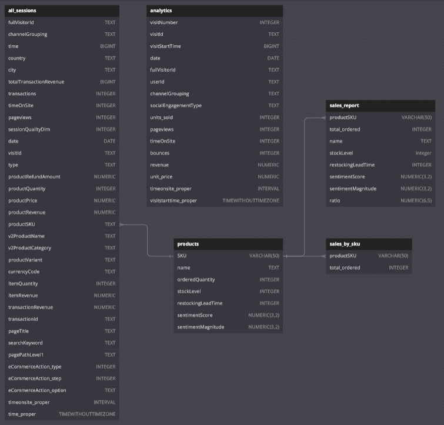
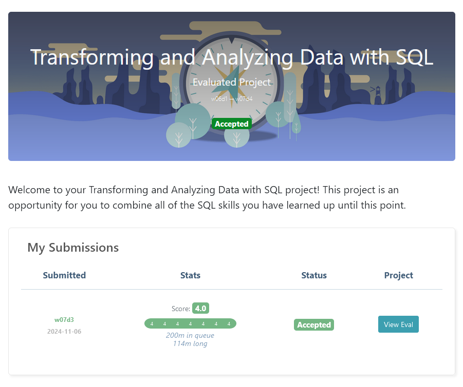

# Final-Project-Transforming-and-Analyzing-Data-with-SQL
## Project/Goals
The project involves a comprehensive analysis of sales and web analytics data to uncover insights about customer behavior and sales performance across various geographic locations.

By examining transaction revenues, product ordering patterns, and product category preferences, the goal is to inform strategic decisions in marketing, sales, inventory management, and customer engagement.

 

**<u>Understanding Revenue Distribution by Geographic Location</u>**
- Identifying top-performing locations by transaction revenue allows us to focus marketing efforts and resource allocation to those cities.
- Summarizing the revenue impact of each city and country to understand their contribution to overall sales.

**<u>Customer Purchasing Behaviors & Assessing Product Performance</u>**
- Finding the average number of products ordered by visitors from different locations provides us with insights on the likelihood of a visitor to purchase a specific product based on where they are located.
- Identifying patterns in product categories preferred in each city and country allows us to tailor product offerings and promotions to that location.

**<u>Determine Peak Site Visit Hours</u>**
- Optimize server resource allocation during high-traffic periods, schedule site updates during off-peak times, and ensure 100% uptime during peak hours to enhance user experience and reduce operational costs.

**<u>Identify Loyal Customer Locations</u>**
- Target promotions, loyalty programs, and customer engagement initiatives in these areas to strengthen customer relationships and increase repeat purchases.
- Develop strategies to improve customer engagement, address potential barriers to repeat visits, and expand market presence in these areas.

 

A significant part of the project was dedicated to understanding the data's intricacies, addressing data quality issues, and ensuring the robustness of the analytical methods and UDFs used.

This thorough foundation was essential before applying these methods to answer key questions, reducing the need for extensive QA and ensuring that the insights produced could effectively guide strategic decisions.

 

# Process
### Exploring each table's CSVs & Loading the Data into the DB

This is where I identified the data types on each table before entering it into the database.
> I used Notepad++, and, to align the columns, I installed the `CSV Lint plugin`, opened the `CSV Lint Window` and clicked "Reformat"

> I used Notion to take notes of what the data types were.

I created the `ecommerce` DB and entered the tables as instructed on the provided links. You can check out the queries used to enter the tables [here](./tools_etc/queries_to_import_csv.md).

### Getting a general overview of each table
To better understand the data at a glance, I created the following User-Defined Functions (UDFs):
  1. [overview_of_each_column('tablename')](./tables_analysis/udf_overview_of_each_column.md)
      - It takes in a table and for each column, shows the count/total number of rows, null values and distinct values.
      - It helps in identifying which columns to use in a table.
  2. [numbers_summary('tablename')](./tables_analysis/udf_numbers_summary.md)
      - It takes in a table and for each numeric column it finds, it shows the five number summary of the column.
      - The **<u>Five Number Summary</u>** gives us an overview of the variability in the data. This function calculates for the MIN, MAX, AVG, Quartiles 1 (25th percentile), 2(median) and 3(75th percentile), and the Interquartile Range (Q3-Q1)
        > As an example, this function showed me that `analytics.units_sold` contains negative values, which could be an indication that the transaction was a refund and not a sale - we don't want to count that as revenue.
  3. [dividebymil(columnname)](./tools_etc/udf_dividebymil.md)
      - Divides a value by 1,000,000 and rounds it to 2 decimal places. It works the same way as using SUM/COUNT/AVG on columns.
      - In this project, it was needed for calculating price or cost related tables where the values are shown in millions.

I found them very useful and I can see myself reusing the `overview_of_each_column` and `numbers_summary` on other databases.
  
### Using Materialized Views
  1. <u>UNIQUE FULL VISITOR IDS</u> - A list of all unique/DISTINCT fullvisitorids FROM analytics and all_sessions table.
     - [Table](./materialized_views/mat_unique_fullvisitorids.csv)
     - [Query](./tools_etc/mat_fullvisitorids.md)
  2. <u>ANALYTICS REVENUE TABLE</u> - A materialized view I created from using `dividebymil` on unit_price and revenue. It shows the `fullvisitorid`, the number of units_sold to them, and the session `date`. It uses `COALESCE` to handle cases where revenue is null by calculating `units_sold * unit_price`.
     - [Table](./materialized_views/mat_analytics_revenue_table.csv)
     - [Query](./tools_etc/mat_analytics_revenue_table.md)
  3. <u>TABLES GENERAL OVERVIEW</u> - A compiled view of the result of calling `overview_of_each_column('table_name')` on every table.
     - [Table](./tables_analysis/overview_of_each_column/_tables_general_overview.csv)
     - [Query](./tables_analysis/udf_overview_of_each_column.md)

#### Tools used
- Github
- PgAdmin
- VS Code
- Notion: Note-taking, Sub-tasks/Project tracking
- [db diagram](https://dbdiagram.io/d): Quick interactive ERDs
- [notepad++](https://notepad-plus-plus.org/): For viewing CSVs

 

## Schema

 

## Results
### 1. We've identified where the majority of transactions are coming from per city and country
The data tells us which locations generate the most transactions on our site to prioritize marketing efforts and resource allocation effectively.
- Majority of transactions and revenue are coming from cities in United States and United Kingdom.
- These locations are key market segments where marketing and sales efforts could be most effective.

### 2. We've identified the peak site visit hours per country
This information helps in optimizing server capacity, planning site updates, and ensuring maximum uptime during high-traffic periods.
- Server Optimization: Knowing peak hours allows for scaling server resources during high-traffic periods to ensure a smooth user experience.
- Maintenance Scheduling: Site updates and maintenance can be scheduled during off-peak hours to minimize disruption.

### 3. We've identified the locations of our most loyal customers
This information helps in tailoring marketing strategies, offering targeted promotions, and improving customer retention.
- <u>High Loyalty Locations</u>
  - These areas are ideal for launching loyalty programs, exclusive offers, and personalized marketing to further strengthen customer relationships.
- <u>Low Loyalty Locations</u>
  - Opportunity exists to investigate why customers aren't returning.
  - Strategies could include improving user experience, follow-up marketing, or addressing any localized issues.

 

## Conclusion
The data provides valuable insights into customer behavior, transaction trends, peak activity times, and loyalty patterns. By analyzing the data, we can make data-driven decisions on where to focus marketing efforts, how to allocate resources, and ways to enhance customer engagement.

 

## Challenges 
1. I forgot my psql passphrase.
  - Here's how I solved it:
    > I went to `C:\Program Files\PostgreSQL\17\data\pg_hba.conf`, disabled the authentication requirements temporarily, and restarted the __PostgreSQL Service__ from **Windows Services** to update the authentication and necessary permissions.
2. Inefficiencies of using **User-Defined Functions (UDFs)**.
  - I noticed an efficiency problem where running the UDF [`overview_of_each_column`](./tables_analysis/udf_overview_of_each_column.md) on some tables could take an unnecessarily long time.
    > I created a materialized view and queried the results. [Here's the longer version](./challenges/udf_inefficiency.md)  of how I solved it.

 

## Future Goals
If we had more time, we could expand our analysis and pursue additional objectives to deepen our understanding of customer behavior and optimize our business strategies.

**<u>Deeper Customer Segmentation Analysis</u>**
- Segment customers based on various criteria such as demographics, purchasing behavior, visit frequency, and average transaction value.
- Create customer personas and target marketing campaigns tailored to different segments.
  > If we had more details about the customers/visitors, we can find which products are popular among specific age groups and put site/product ads on platforms where users of this age group in specific locations are more prominent.

**<u>Location-based Consumer Behavior Analysis</u>**
- This will allow us to develop location-specific strategies and adapt the user experience and marketing messages to fit the cultural preferences and needs of different high-traffic countries.
  > Maybe start offering local products/brands in that region.

**<u>Analyzing Referral Sources and Influences</u>**
- Delve deeper in the analysis of referral paths to understand which channels have the highest conversion rates and align marketing budgets accordingly.
  > Some marketing channels could be costing us more than it's worth to maintain.

  > For example, running ad campaigns in your website can be lucrative for site owners, but can be **quite costly** if you're the one paying them to run ads for you.

**<u>Conversion Rate Analysis</u>**
- Investigate the behavioral differences between new visitors and returning customers to optimize the user experience and retention for both.
  > Here is where we identify how long (time) an average visitor spends on the site, and how much (revenue) they are buying.

  > This will also tell us how long of a time window we have to encourage the customer to stay on the site and make a purchase.
  
    - For example: At 2min mark, start popping up with discount codes for the product they're looking at or previously looked at.

### Grade
