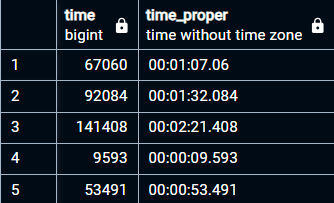
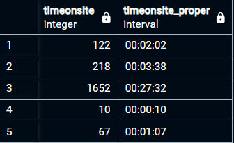
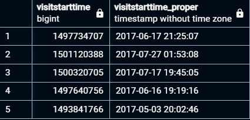
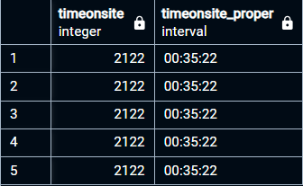

# Problem 04
Inconsistency in the ff. time-related entries.

- `all_sessions.timeonsite` is in __seconds__
	- Recorded as `INT`
- `all_sessions.time` is in __milliseconds__
	- Recorded as `BIGINT`
- `analytics.timeonsite` is in __seconds__
	- Recorded as `BIGINT`
- `analytics.visitstarttime` is in __seconds__
	- Recorded as `INT`

## **Solution:**
I added new columns with updated and properly formatted values.

### Query
- `all_sessions` table
```
-- Adding new columns
	ALTER TABLE all_sessions
	ADD COLUMN timeonsite_proper INTERVAL,
	ADD COLUMN time_proper TIME;

-- Updating new columns
	-- Update timeonsite_proper
	UPDATE analytics
	SET timeonsite_proper = timeonsite * INTERVAL '1 second';
		
	-- Update visitstarttime_proper
	UPDATE analytics
	SET visitstarttime_proper = TO_TIMESTAMP(visitstarttime);
```

- `analytics` table
```
-- Adding new columns
	ALTER TABLE analytics
	ADD COLUMN timeonsite_proper INTERVAL,
	ADD COLUMN visitstarttime_proper TIMESTAMP;

-- Updating new columns
	-- Update timeonsite_proper
	UPDATE all_sessions
	SET timeonsite_proper = timeonsite * INTERVAL '1 second';
			
	-- Update time_proper
	UPDATE all_sessions
	SET time_proper = time * INTERVAL '1 millisecond';
```

### QA
Exploratory Queries:
```
-- Getting an overview of which columns to check and which table they're in.
SELECT * FROM tables_general_overview
	WHERE column_name LIKE '%time%'

-- Getting the range of values
SELECT * FROM numbers_summary('analytics')
SELECT * FROM numbers_summary('all_sessions')
```

How are they measuring the time? Is this in `seconds` or `milliseconds`? I used the following queries to check.

`ALL_SESSIONS` table:
```
-- Checking if SECONDS
SELECT
  (SELECT MIN(time)FROM all_sessions WHERE time != 0) AS minTime,
  MAX(time)
		AS max_time,
  (MIN(time) * INTERVAL '1 second') AS min_time_in_seconds,
  (MAX(time) * INTERVAL '1 second') AS max_time_in_seconds
FROM all_sessions

-- minTime is 0 and maxTime is 888h 46m 50ms ... which is about 37 days, this doesn't make sense.

-- Checking if MILLISECONDS
SELECT
  (SELECT MIN(time)FROM all_sessions WHERE time != 0)
		AS minTime,
  MAX(time)
		AS max_time,
  (MIN(time) * INTERVAL '1 millisecond')
		AS min_time_in_milliseconds,
  (MAX(time) * INTERVAL '1 millisecond')
		AS max_time_in_milliseconds
FROM all_sessions

-- minTime is 0, maxTime is 53m 12s 41ms ... This seems more realistic
```
`ANALYTICS` table:
```
-- Checking if SECONDS
SELECT
  (SELECT MIN(timeonsite) FROM analytics WHERE timeonsite != 0) AS min_time,
  MAX(timeonsite) AS max_time,
  (MIN(timeonsite) * INTERVAL '1 second') AS min_time_interval,
  (MAX(timeonsite) * INTERVAL '1 second') AS max_time_interval
FROM analytics;
-- minTime is 01 and maxTime is 3h 08m 36s ... This makes sense for a min and max time

-- Checking if MILLISECONDS
SELECT
  (SELECT MIN(timeonsite) FROM analytics WHERE timeonsite != 0) AS min_time,
  MAX(timeonsite) AS max_time,
  (MIN(timeonsite) * INTERVAL '1 millisecond') AS min_time_interval,
  (MAX(timeonsite) * INTERVAL '1 millisecond') AS max_time_interval
FROM analytics;
-- minTime is .001s and maxTime is 11.316s ... This doesn't make sense.

-- Converting visitStartTime
SELECT
  MIN(visitstarttime) AS min_visitstarttime,
  MAX(visitstarttime) AS max_visitstarttime,
  TO_TIMESTAMP(MIN(visitstarttime)) AT TIME ZONE 'UTC' AS min_visit_datetime,
  TO_TIMESTAMP(MAX(visitstarttime)) AT TIME ZONE 'UTC' AS max_visit_datetime
FROM analytics;

/*
MIN: 1493622000 --- MAX: 1501657190
MIN converted: "2017-05-01 07:00:00"
MAX converted: "2017-08-02 06:59:50"
*/
```

Verifying that tables were updated:
**`all_sessions` table**
```
-- time
SELECT time, time_proper
FROM all_sessions
WHERE time IS NOT NULL
LIMIT 5;

-- timeonsite
SELECT timeonsite, timeonsite_proper
FROM all_sessions
WHERE timeonsite IS NOT NULL
LIMIT 5;
```
- Results:
- 
- 

**`analytics` table**
```
-- visitStartTime
SELECT visitstarttime, visitstarttime_proper
FROM analytics
WHERE visitstarttime IS NOT NULL
LIMIT 5;

-- timeOnSite
SELECT timeonsite, timeonsite_proper
FROM analytics
WHERE timeonsite IS NOT NULL
LIMIT 5;
```
- Results:
- 
- 


> Also updated [`tables_general_overview`](../tables_analysis/overview_of_each_column/_tables_general_overview.csv)  to reflect the new columns.