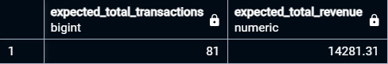

# Question 1: Which cities and countries have the highest level of transactions on the site?
*This question shows us where most of our transactions are coming from.*

For this answer, First I reviewed the following relevant columns from `all_sessions` table:
  * totaltransactionrevenue
  * transactions
  * transactionrevenue

This is the query I used:
```
SELECT 
    als.city,
    als.country,
    SUM(dividebymil(als.totaltransactionrevenue)) AS total_revenue,
    SUM(als.transactions) AS total_transactions,
    COUNT(*) AS transaction_count
FROM all_sessions als
WHERE 
    als.totaltransactionrevenue IS NOT NULL
    OR als.transactions IS NOT NULL
    OR als.transactionrevenue IS NOT NULL
GROUP BY als.city, als.country
ORDER BY total_revenue DESC
LIMIT 5;
```


Using a CTE, I checked for the SUM of `total_transactions` and `total_revenue` from the query.
```
WITH data_query AS (
	SELECT 
	    als.city,
	    als.country,
	    SUM(dividebymil(als.totaltransactionrevenue)) AS total_revenue,
	    SUM(als.transactions) AS total_transactions,
	    COUNT(*) AS transaction_count
	FROM all_sessions als
	WHERE 
	    als.totaltransactionrevenue IS NOT NULL
	    OR als.transactions IS NOT NULL
	    OR als.transactionrevenue IS NOT NULL
	GROUP BY als.city, als.country
	ORDER BY total_revenue DESC
	-- LIMIT 5;
	)
SELECT SUM(total_revenue), SUM(total_transactions) FROM data_query
```

I checked if the aggregation results matches the expected counts.
```
SELECT SUM(transactions) AS expected_total_transactions,
       SUM(dividebymil(totaltransactionrevenue)) AS expected_total_revenue
FROM all_sessions
WHERE totaltransactionrevenue IS NOT NULL
    OR transactions IS NOT NULL
    OR transactionrevenue IS NOT NULL;
```


#### It matches.