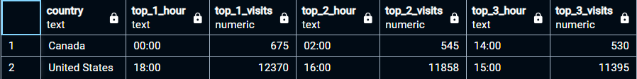

#
Consider the data you have available to you.  You can use the data to:
- find all duplicate records
- find the total number of unique visitors (`fullVisitorID`)
	- `SELECT COUNT(*) FROM unique_fullVisitorIds`
	- Answer: __130,045__
- find the total number of unique visitors by referring sites
	- Answer:
	- 
	- ```
		WITH referredVisits AS (
			SELECT
				als.fullvisitorid,
				als.pagepathlevel1 AS referralSource,
				ROW_NUMBER() OVER 	(PARTITION BY als.fullvisitorid
														ORDER BY als.date, als.date)
														AS referralNumber
				FROM	all_sessions als
				WHERE	als.channelgrouping = 'Referral'
		)
			SELECT	rVs.referralSource,
						COUNT(DISTINCT rVs.fullvisitorid) AS uniqueVisitorCount
			FROM	referredVisits rVs
			WHERE	rVs.referralNumber = 1
			GROUP BY	rVs.referralSource
			ORDER BY	uniqueVisitorCount DESC;
		```
- find each unique product viewed by each visitor
- compute the percentage of visitors to the site that actually makes a purchase

# New Questions:
## Question 1: Which cities and countries have the highest number of transactions on the site?
*This question shows us where most of our transactions are coming from.*

### **Answer:**
The top 5 Cities and their respective countries with the highest level of transactions are shown below:


> [QA Section of Data Question 1](./data_questions_qa/data_q1_qa.md)

**SQL Query:**
```sql
SELECT 
    als.city,
    als.country,
    SUM(dividebymil(als.totaltransactionrevenue)) AS total_revenue,
    SUM(als.transactions) AS total_transactions,
    COUNT(*) AS transaction_count
FROM all_sessions als
WHERE 
    als.totaltransactionrevenue IS NOT NULL
    OR als.transactions IS NOT NULL
    OR als.transactionrevenue IS NOT NULL
GROUP BY als.city, als.country
ORDER BY total_revenue DESC
LIMIT 5;
```


## Question 2: What are the site's peak hours per country?
This aims to determine peak hours for site visits across different cities and countries to help us optimize our server space allocation and plan site updates more efficiently while ensuring we have 100% up time at peak hours.

### Answer:
Example use case:

- This tells us the peak hours in Canada and the US. From here, we can find optimal update windows and when to allocate more server space per country, per hour. *Also for cutting down on server costs*

> [QA Section of Data Question 2](./data_questions_qa/data_q2_qa.md)

**SQL Query:**
```sql
WITH
visitor_times AS (
    -- Use visitstarttime_proper for already converted times
    SELECT
        a.fullVisitorId,
        als.city,
        als.country,
        visitstarttime_proper,
        TO_CHAR(visitstarttime_proper, 'HH24:00') AS visit_hour
    FROM
        analytics a
    JOIN
        unique_fullvisitorids u ON a.fullVisitorId = u.fullVisitorId
    JOIN
        all_sessions als ON a.fullVisitorId = als.fullVisitorId
    WHERE
        visitstarttime_proper IS NOT NULL
        AND als.city IS NOT NULL
        AND als.country IS NOT NULL
        AND als.country != '(not set)'
), visit_counts AS (
    -- Query to count the number of visits per hour per city and country
    SELECT
        country,
        city,
        visit_hour,
        COUNT(*) AS num_visits
    FROM
        visitor_times
    GROUP BY
        country,
        city,
        visit_hour
    ORDER BY
        num_visits DESC,
        country,
        city,
        visit_hour
), time_of_day_visitors AS (
    -- Avg num of visits per hour, per country
    SELECT 
        country,
        city,
        visit_hour,
        ROUND(AVG(num_visits)) AS visitor_avg
    FROM 
        visit_counts
    GROUP BY
        country,
        city,
        visit_hour
    ORDER BY
        visitor_avg DESC,
        visit_hour,
        country,
        city
), mode_visit_time AS (
    -- Find the mode (most popular visit hour) across countries
    SELECT
        country,
        visit_hour,
        SUM(visitor_avg) AS total_visits,
        RANK() OVER (
            PARTITION BY country
            ORDER BY SUM(visitor_avg) DESC
        ) AS visit_rank
    FROM
        time_of_day_visitors
    GROUP BY
        country,
        visit_hour
    ORDER BY
        total_visits DESC
)
-- Select the top 3 most popular visit times for each country to show in a summary table
SELECT
    country,
    MAX(CASE WHEN visit_rank = 1 THEN visit_hour END) AS top_1_hour,
    MAX(CASE WHEN visit_rank = 1 THEN total_visits END) AS top_1_visits,
    MAX(CASE WHEN visit_rank = 2 THEN visit_hour END) AS top_2_hour,
    MAX(CASE WHEN visit_rank = 2 THEN total_visits END) AS top_2_visits,
    MAX(CASE WHEN visit_rank = 3 THEN visit_hour END) AS top_3_hour,
    MAX(CASE WHEN visit_rank = 3 THEN total_visits END) AS top_3_visits
FROM
    mode_visit_time
WHERE
    visit_rank <= 3
GROUP BY
    country
ORDER BY
    country;

--- convert the previous query into another CTE to look for specific countries:
SELECT * FROM select_country WHERE country IN ('Canada', 'United States')
```

## Question 3: Where are our most loyal customers located?
*This analysis provides us insights into user loyalty and engagement in different locations.*

We can run promotions and sales to reward/target repeat customers.

### Answer:
We have 100% customer Loyalty in 15 cities:


> We also have 85 countries where there is 0 customer loyalty (no repeat visits)

**SQL Query**
```sql
WITH repeat_visitors AS (
    SELECT
	-- Counting total visits and repeats
        a.fullVisitorId,
        als.city,
        als.country,
        COUNT(*) AS total_visits,
        SUM(CASE WHEN a.visitnumber > 1 THEN 1 ELSE 0 END) AS repeat_visits
    FROM
        analytics a
    JOIN
        unique_fullvisitorids u ON a.fullVisitorId = u.fullVisitorId
    JOIN
        all_sessions als ON a.fullVisitorId = als.fullVisitorId
    WHERE
        als.city IS NOT NULL
        AND als.country IS NOT NULL
        AND als.country != '(not set)'
    GROUP BY
        a.fullVisitorId,
        als.city,
        als.country
)

-- Main query to summarize repeat visitor percentages per city and country
SELECT
    country,
    city,
    SUM(repeat_visits) AS total_repeat_visits,
    SUM(total_visits) AS total_visits,
    ROUND((SUM(repeat_visits) * 100.0) / SUM(total_visits), 2) AS repeat_visit_percentage
FROM
    repeat_visitors
GROUP BY
    country,
    city
ORDER BY
    repeat_visit_percentage DESC,
    total_repeat_visits DESC;
```