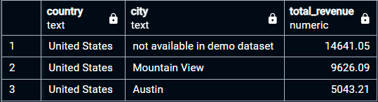

# Answer the following questions and provide the SQL queries used to find the answer.

    
## Question 1: Which cities and countries have the highest level of transaction revenues on the site?
Here's how I approached this:
  - I used the [`analytics_revenue_table`](./tools_etc/mat_analytics_revenue_table.md) to get the revenue per `fullVisitorId` and session `date`.
  - I cross-referenced it with `all_sessions` table to get the `city` and `country`.

### Answer:
Our top 3 cities with the highest level of transaction revenues are shown below:


> View the full csv of the results [here.](./assignment_query_results/q1_query.csv)

#### SQL Queries:
```sql
WITH visitor_revenue AS (
	-- Aggregates total revenue per fullVisitorId and date from analytics_revenue_table
    SELECT
        fullVisitorId,
        date,
        SUM(revenue) AS total_revenue
    FROM
        analytics_revenue_table
    GROUP BY
        fullVisitorId,
        date
),

visitor_locations AS (
	-- Extracts unique combinations of fullVisitorId, date, country, and city from all_sessions
    SELECT DISTINCT
        fullVisitorId,
        date,
        country,
        city
    FROM
        all_sessions
    WHERE
        country IS NOT NULL
        AND city IS NOT NULL
)

-- The main query Joins visitor_revenue with visitor_locations on fullVisitorId and date to associate revenue with locations. It aggregates revenue per country and city and orders by total_revenue to summarize the impact of revenue from each location.
SELECT
    vl.country,
    vl.city,
    SUM(vr.total_revenue) AS total_revenue
FROM
    visitor_revenue vr
JOIN
    visitor_locations vl ON
    vr.fullVisitorId = vl.fullVisitorId AND
    vr.date = vl.date
GROUP BY
    vl.country,
    vl.city
ORDER BY
    total_revenue DESC
LIMIT 3 ; -- 19 rows total before the limit.
```

<br>

## Question 2: What is the average number of products ordered from visitors in each city and country?
Here's how I approached this:
- I used the [`analytics_revenue_table`](./tools_etc/mat_analytics_revenue_table.md) to get `units_sold` per `fullVisitorId` and `date`.
- Join with all_sessions to match with `city` and `country`
### Answer:
Majority of the orders are coming from the United States, the average ranges between 1 and 37 across 13 cities. The **top 3** US cities are:
- Los Angeles: 37
- Austin: 35
- Chicago: 10

#### SQL Queries:
```sql
WITH visitor_units AS (
  -- Aggregate units_sold per visitor per date
    SELECT
        fullVisitorId,
        date,
        SUM(units_sold) AS total_units_sold
    FROM
        analytics_revenue_table
    GROUP BY
        fullVisitorId,
        date
),

visitor_locations AS (
-- Get visitor locations
    SELECT DISTINCT
        fullVisitorId,
        date,
        country,
        city
    FROM
        all_sessions
    WHERE
        country IS NOT NULL
        AND city IS NOT NULL
)

SELECT
-- Calculate average units sold per location
    vl.country,
    vl.city,
    ROUND(AVG(vu.total_units_sold)) AS avg_units_sold
FROM
    visitor_units vu
JOIN
    visitor_locations vl ON
    vu.fullVisitorId = vl.fullVisitorId AND
    vu.date = vl.date
GROUP BY
    vl.country,
    vl.city
ORDER BY
	country,
    avg_units_sold DESC
```
> View the full csv of the Main Query's results [here.](./assignment_query_results/q2_query.csv)

<br>

## Question 3: Is there any pattern in the types (product categories) of products ordered from visitors in each city and country?
Here's how I approached this:
- I used `v2ProductCategory` from `all_sessions` to identify product categories. Since it has **no null** values, I can include all the records.
- Count the number of orders per product category in each city and country and ordered the results to begin observing patterns in the higher categories.
- Upon initial inspection, I saw recurring categories of product across multiple countries and tried to confirm what I gathered.

### Answer:
Yes. YouTube and Google branded products, Electronics and Men's apparel, appear consistently across different countries and cities. This observation suggests a possible trend: these categories may be universally popular, which could imply:

  * __Widespread Brand Recognition__ (Popular global brands (YouTube, Google)) are consistently ordered.

  * __Common Product Preferences__ Categories like Men’s T-Shirts and Electronics indicate that certain general product types (e.g., clothing, electronics) have broad, cross-country appeal.

#### SQL Queries:
```sql
WITH
orders_by_category AS (
-- This counts how many times each product category was ordered in each city and country, ordered by most to least (DESC)
	SELECT
	    country,
	    city,
	    v2ProductCategory,
	    COUNT(*) AS num_orders
	FROM
	    all_sessions
	WHERE
	    v2ProductCategory IS NOT NULL
	GROUP BY
	    country,
	    city,
	    v2ProductCategory
	ORDER BY
	    num_orders DESC,
		country,
	    city
)

-- Main Query #1 aggregates orders by grouping them based on the country, city, and product category. It then calculates the total number of orders for each unique combination of these fields. Sorting (ORDER BY) is applied at the end to list the data by country and city with the highest order counts first:

SELECT
	SUM(num_orders) AS total_orders,
    country,
    city,
    v2productcategory
FROM
    orders_by_category
GROUP BY
    country,
    city,
    v2productcategory
ORDER BY
    country,
    city,
	  total_orders DESC;

-- Main Query #2 counts the occurrences of each product category across different countries and cities:

SELECT
    v2productcategory,
    COUNT(DISTINCT country) AS num_countries,
    COUNT(DISTINCT city) AS num_cities,
    SUM(num_orders) AS total_orders
FROM
    orders_by_category
GROUP BY
    v2productcategory
ORDER BY
    total_orders DESC;
```
> View the full csv of Main Query #1's results [here.](./assignment_query_results/q3_query_a.csv)

> View the full csv of Main Query #2's results [here.](./assignment_query_results/q3_query_b.csv)

<br>

## Question 4: What is the top-selling product from each city/country? Can we find any pattern worthy of noting in the products sold?
Here's how I approached this:
  - I used `productSKU` and `productQuantity` from `all_sessions`, excluding nulls and zeroes.
  - I ranked them with a window function to calculate total quantity sold per product in each `city` and `country`.

### Answer:
Upon reviewing the results of this query, it <u>confirms</u> what we found on question 3 where the popular products are mainly in the Electronics and Apparel categories or Youtube/Google branded.

#### SQL Queries:
```sql
WITH product_sales AS (
	-- This table summarizes total quantities sold per product SKU in each city and country.
    SELECT
        country,
        city,
        productSKU,
        SUM(productQuantity) AS total_quantity
    FROM
        all_sessions
    WHERE
        productSKU IS NOT NULL
        AND productQuantity IS NOT NULL
        AND productQuantity <> 0
    GROUP BY
        country,
        city,
        productSKU
),
ranked_products AS (
	-- This query assigns a rank to each product within its city and country based on total quantity sold
    SELECT
        country,
        city,
        productSKU,
        total_quantity,
        RANK() OVER (
            PARTITION BY country, city
            ORDER BY total_quantity DESC
        ) AS rank
    FROM
        product_sales
)

-- The main query retrieves the top-selling product (rank = 1) for each city and country and adds products.name to show the product.
SELECT
    rp.country,
    rp.city,
    p.name,
    rp.total_quantity,
	rp.productSKU
FROM
    ranked_products rp
LEFT JOIN products p
	ON p.sku = rp.productsku
WHERE
    rank = 1
ORDER BY
	country,
	city,
	total_quantity DESC;
```
> View the full csv of the results [here.](./assignment_query_results/q4_query.csv)

<br>

## Question 5: Can we summarize the impact of revenue generated from each city/country?
Here's how I approached this:
- I used the [`analytics_revenue_table`](./tools_etc/mat_analytics_revenue_table.md) to get the revenue per `fullVisitorId` and session `date`.
- I cross-referenced it with all_sessions table to get the `city` and `country`.

### Answer:
Our cities with the highest level of transaction revenues are shown below. This is similar to Q1.

> View the full csv of the results [here.](./assignment_query_results/q5_query.csv)

#### SQL Queries:
```sql
WITH visitor_revenue AS (
	-- Aggregates total revenue per fullVisitorId and date from analytics_revenue_table
    SELECT
        fullVisitorId,
        date,
        SUM(revenue) AS total_revenue
    FROM
        analytics_revenue_table
    GROUP BY
        fullVisitorId,
        date
),

visitor_locations AS (
	-- Extracts unique combinations of fullVisitorId, date, country, and city from all_sessions
    SELECT DISTINCT
        fullVisitorId,
        date,
        country,
        city
    FROM
        all_sessions
    WHERE
        country IS NOT NULL
        AND city IS NOT NULL
)

-- The main query Joins visitor_revenue with visitor_locations on fullVisitorId and date to associate revenue with locations.
-- It aggregates revenue per country and city and orders by total_revenue to summarize the impact of revenue from each location.
SELECT
    vl.country,
    vl.city,
    SUM(vr.total_revenue) AS total_revenue
FROM
    visitor_revenue vr
JOIN
    visitor_locations vl ON
    vr.fullVisitorId = vl.fullVisitorId AND
    vr.date = vl.date
GROUP BY
    vl.country,
    vl.city
ORDER BY
    total_revenue DESC;
```