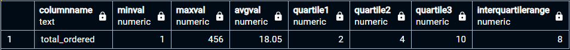

## `numbers_summary('table_name')`
### User Defined Function (UDF)
A User Defined Function (UDF) that takes the name of a table as a parameter and returns statistical summaries for each numeric column in that table. The function outputs the following for each numeric column:
    - Column name (columnName)
    - Minimum value (minVal)
    - Maximum value (maxVal)
    - Average value (avgVal)
    - 25th percentile (quartile1)
    - 50th percentile/median (quartile2)
    - 75th percentile (quartile3)
    - Interquartile range (Q3 - Q1) (interquartileRange)

### Use case:
`SELECT * FROM numbers_summary('sales_by_sku')`



### Calling the function matches the ff data:
```
SELECT
    'total_ordered' AS columnName,
    MIN(total_ordered) AS minVal,
    MAX(total_ordered) AS maxVal,
    ROUND(AVG(total_ordered), 2) AS avgVal,
    PERCENTILE_CONT(0.25) WITHIN GROUP (ORDER BY total_ordered) AS quartile1,
    PERCENTILE_CONT(0.5) WITHIN GROUP (ORDER BY total_ordered) AS quartile2,
    PERCENTILE_CONT(0.75) WITHIN GROUP (ORDER BY total_ordered) AS quartile3,
    PERCENTILE_CONT(0.75) WITHIN GROUP (ORDER BY total_ordered) - PERCENTILE_CONT(0.25) WITHIN GROUP (ORDER BY total_ordered) AS interquartileRange
FROM sales_by_sku
WHERE total_ordered IS NOT NULL AND total_ordered <> 0;
```

### The Query
```
CREATE OR REPLACE FUNCTION numbers_summary(tableName TEXT)
RETURNS TABLE (
    columnName TEXT,
    minVal NUMERIC,
    maxVal NUMERIC,
    avgVal NUMERIC,
    quartile1 NUMERIC,
    quartile2 NUMERIC,
    quartile3 NUMERIC,
    interquartileRange NUMERIC
) AS $$
DECLARE
    col RECORD;
    sql TEXT;
BEGIN
    -- Loop through each numeric column in the specified table
    FOR col IN
        SELECT column_name
        FROM information_schema.columns
        WHERE table_name = lower(tableName)
          AND table_schema = 'public' -- Specifying the schema to avoid ambiguity
          AND data_type IN ('integer', 'numeric', 'real', 'double precision', 'smallint', 'bigint', 'decimal')
    LOOP
        -- The SQL query to run on included columns
        sql := format(
            'SELECT 
                %1$L AS columnName,
                MIN(%2$I)::NUMERIC AS minVal,
                MAX(%2$I)::NUMERIC AS maxVal,
                ROUND(AVG(%2$I),2)::NUMERIC AS avgVal,
                percentile_cont(0.25) WITHIN GROUP (ORDER BY %2$I)::NUMERIC AS quartile1,
                percentile_cont(0.5) WITHIN GROUP (ORDER BY %2$I)::NUMERIC AS quartile2,
                percentile_cont(0.75) WITHIN GROUP (ORDER BY %2$I)::NUMERIC AS quartile3,
                (percentile_cont(0.75) WITHIN GROUP (ORDER BY %2$I) - percentile_cont(0.25) WITHIN GROUP (ORDER BY %2$I))::NUMERIC AS interquartileRange
             FROM %3$I.%4$I
             WHERE %2$I <> 0 AND %2$I IS NOT NULL',
            col.column_name,    -- %1$: columnName as a literal
            col.column_name,    -- %2$: columnName as an identifier (used multiple times)
            'public',           -- %3$: Schema name
            lower(tableName)  -- %4$: Table name in lowercase
        );
        RETURN QUERY EXECUTE sql;
    END LOOP;
END;
```