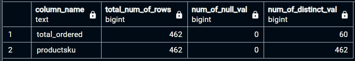

## `overview_of_each_column('table_name')`
### User Defined Function (UDF)
A User Defined Function (UDF) that takes in a whole table as a parameter to show each column, their names and the ff corresponding values:
- total number of rows
- number of NULL values
- number of DISTINCT values

### Use case:
`SELECT * FROM overview_of_each_column('sales_by_sku')`



### Calling the function matches the data from the ff. queries:
```sql
SELECT COUNT(*) FROM sales_by_sku		-- Result is 462
	-- WHERE	total_ordered	IS NULL -- Result is 0
	-- WHERE	productsku		IS NULL -- Result is 0

	SELECT	COUNT(DISTINCT total_ordered)
        FROM sales_by_sku -- Result is 60

	SELECT	COUNT(DISTINCT productsku)	
        FROM sales_by_sku -- Result is 462
```

### The Query
```sql
CREATE OR REPLACE FUNCTION overview_of_each_column(tableName TEXT)

RETURNS TABLE(
    column_name TEXT,
    total_num_of_rows BIGINT,
    num_of_null_val BIGINT,
    num_of_distinct_val BIGINT
) AS $$

DECLARE
    col RECORD;
    sql TEXT;

BEGIN
-- Loop through each column in the specified table
FOR col IN
    SELECT c.table_schema, c.column_name
    FROM information_schema.columns AS c
    WHERE c.table_name = tableName
-- The SQL query to run on every column
LOOP
sql := format('
    SELECT
        %L,
        -- Column name as a literal string
        COUNT(*),
        -- Count of rows
        COUNT(*) - COUNT(%I),
        -- Count of NULL values
        COUNT(DISTINCT %I)
        -- Count of distinct non-NULL values
        FROM %I.%I',
        -- Schema-qualified table name
        col.column_name,
        -- Literal string for the column name
        col.column_name,
        -- Column identifier for count of NULLs
        col.column_name,
        -- Column identifier for count of distinct non-NULLs
        col.table_schema,
        -- Schema name
        tableName);
        -- Table name

        RETURN QUERY EXECUTE sql;
    END LOOP;
END;
$$ LANGUAGE plpgsql;
```
