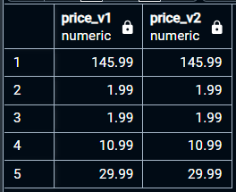

## `dividebymil('table_name')`
### User Defined Function (UDF)
A User-Defined Function that divides a column's value by 1,000,000 and rounds it to 2 decimal points.

```sql
CREATE OR REPLACE FUNCTION dividebymil(num NUMERIC)
RETURNS NUMERIC AS
$$
BEGIN
    RETURN ROUND(num / 1000000, 2);
END;
$$ LANGUAGE plpgsql;
```

### Use case:
It works the same way as SUM/COUNT/AVG.

Example: `SELECT dividebymil(unit_price) FROM analytics`

### Calling the function matches the data gained from calculating it in-line:
```sql
SELECT
	ROUND((unit_price/1000000),2) as price_v1,
	dividebymil(unit_price) as price_v2
FROM analytics
WHERE units_sold > 0
ORDER BY units_sold DESC
LIMIT 5
```
Result:

